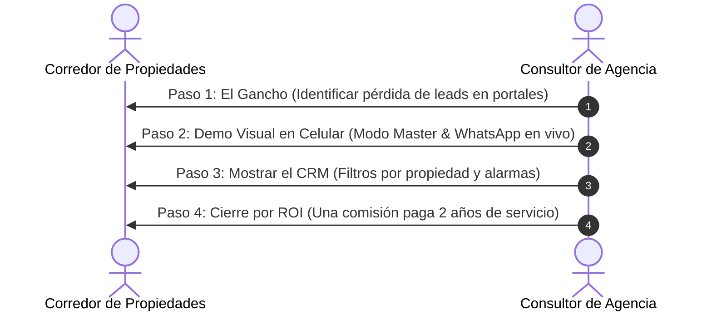

# 📑 Propuesta Comercial & Guía de Venta Consultiva
## Ecosistema de Captación y Conversión Inmobiliaria con Inteligencia Artificial

---

### 📌 Resumen Ejecutivo
Este documento contiene la **estructura de precios, planes de suscripción mensual (MRR)** y el **manual de venta rápida con script de demostración en vivo** para ofrecer el ecosistema inmobiliario a corredores de propiedades, corredoras boutique e inmobiliarias.

---

## 1. 💰 Estructura de Planes y Precios Recurrentes (MRR)

| Plan | Qué Incluye | Precio Sugerido (CLP) |
| :--- | :--- | :--- |
| **Plan 1: Portal Web & CRM** | - Landing Page inmobiliaria de lujo (responsive & mobile-first) - Catálogo de propiedades con conversión UF / $ CLP en vivo - Simulador de crédito hipotecario integrado - Módulo de captación de propietarios con carga de fotos - Panel CRM de Leads (Kanban + Modo Tabla Excel) - Buscador universal y alarmas de vencimiento (SLA) - Hosting en Vercel con certificado SSL incluido | **$49.990 / mes** |
| **Plan 2: Agente WhatsApp IA** | - Línea de WhatsApp Business oficial con YCloud - Asistente de IA entrenado con el catálogo de propiedades - Buffer inteligente con recepción de texto, notas de voz y fotos - Calificación automática de prospectos (presupuesto y crédito) - Agendamiento autónomo de visitas - Derivación y alertas al WhatsApp del corredor - Panel de conversaciones en tiempo real | **$69.990 / mes** |
| **Plan 3: Ecosistema 360° Full** *(Recomendado / Más Vendido)* | - **Todo lo del Plan Portal Web & CRM** - **Todo lo del Plan Agente WhatsApp IA** - Sincronización bidireccional Web ↔ WhatsApp - El lead que entra por la web activa el bot al instante - Disparo automático de fichas técnicas en PDF por WhatsApp - Soporte técnico prioritario 1-a-1 - Actualizaciones mensuales del modelo de IA | **$99.990 / mes** |

---

### 🛠️ Servicios y Módulos Adicionales (Up-Sells)

1. **Setup Inicial & Personalización de Marca (Pago Único):**  
   - **Valor:** `$75.000 CLP` *(Opcional)*
   - **Incluye:** Carga de logotipo en alta resolución, configuración de colores de marca, conexión de dominio propio `.CL` y carga inicial de las primeras 10 propiedades del corredor.

2. **Desarrollo de Módulos a Medida:**  
   - **Valor:** `$150.000 a $300.000 CLP` *(Pago Único)*
   - **Ejemplos:** Calculadora personalizada de rentabilidad de arriendos, mapas 3D de proyectos o integraciones API personalizadas.

3. **Ejecutivo Adicional (Multi-Agente WhatsApp):**  
   - **Valor:** `$29.990 CLP / mes` por cada corredor adicional con enrutamiento de prospectos por turnos (*Round-Robin*).

---

## 2. 🎯 Guía Rápida de Ventas: Cómo presentar y cerrar al Corredor

### ⏱️ Protocolo de Demostración en 4 Pasos (10 a 15 Minutos)

#### Paso 1: El Gancho de Entrada (El Dolor del Corredor - 2 minutos)
> *"Estimado [Nombre], la gran mayoría de los corredores pierde el 60% de los interesados que consultan en Portales Inmobiliarios porque nadie les responde en los primeros 15 minutos o porque sus propiedades están mezcladas con las de su competencia. Nosotros implementamos un ecosistema privado que atiende, califica y agenda visitas en 10 segundos las 24 horas del día."*

#### Paso 2: La Demostración Visual en Vivo (5 minutos)
- Abre la web en tu celular o tablet.
- **Efecto Wow:** Haz 3 clics en el logo del panel, entra al *Modo Master* y cambia el nombre o la paleta de colores para mostrar que el sitio se viste con su marca en 10 segundos.
- **Interacción Real:** Pídele que le escriba un mensaje al número de WhatsApp de prueba. Que viva en carne propia cómo el bot le responde en 3 segundos, le pregunta su presupuesto y le ofrece agendar una visita.

#### Paso 3: El Panel de Gestión de Alto Volumen (3 minutos)
> *"Mira tu panel CRM: aquí ves a todos tus clientes ordenados. Puedes filtrar con un solo clic los clientes que tienen visitas hoy, o ver exactamente quiénes consultaron por tu casa en Las Condes sin tener que revolver cientos de chats desordenados de WhatsApp."*

#### Paso 4: El Cierre por Retorno de Inversión (ROI - 2 minutos)
> *"El plan completo cuesta $99.990 al mes. Con solo UN arriendo o UNA venta que el asistente de IA te ayude a rescatar en todo el año, el sistema ya se pagó solo por los próximos 2 años completos. ¿Te dejamos la plataforma lista y conectada a tu WhatsApp este viernes?"*

---

## 3. 🛡️ Manejo de Objeciones Frecuentes

### ❌ Objeción 1: *"Ya publico en PortalInmobiliario y TocToc, no necesito otra web."*
💡 **Respuesta:**  
*"Exacto, los portales son geniales para publicar, pero ahí tu propiedad compite al lado de otras 50 similares. Este ecosistema es tu canal privado de cierre donde el cliente no ve a otros corredores y donde nuestro agente de IA atiende y califica de inmediato a los prospectos que llegan de tus redes o de tus letreros físicos."*

---

### ❌ Objeción 2: *"Yo prefiero responder el WhatsApp personalmente a mis clientes."*
💡 **Respuesta:**  
*"Por supuesto, tú eres el experto cerrando ventas. El agente de IA no reemplaza tu llamada; solo hace el trabajo repetitivo de filtrar curiosos a las 11 de la noche, verificar si tienen crédito pre-aprobado y entregarte el cliente listo en bandeja para que tú solo vayas a mostrar la propiedad."*

---

### ❌ Objeción 3: *"No tengo tiempo ni conocimientos técnicos para administrar una plataforma."*
💡 **Respuesta:**  
*"Nosotros nos encargamos del 100% de la parte técnica. Te entregamos la web y el WhatsApp listos para operar. Para subir una propiedad solo arrastras las fotos desde tu computador en 1 minuto o nos envías los datos por correo y nosotros lo configuramos."*

---

## 4. 🚀 Cómo Generar el Archivo PDF Listo para Enviar:
1. Abre tu navegador y accede a:  
   `file:///B:/OneDrive/Desarrollo-IA/software/landing-ventas/public/propuesta_comercial_pdf.html`  
   *(o cuando esté en Vercel en `https://tu-web.vercel.app/propuesta_comercial_pdf.html`)*
2. Haz clic en el botón superior **"🖨️ Guardar o Imprimir en PDF"** (o presiona `Ctrl + P`).
3. En destino selecciona **"Guardar como PDF"**. El diseño ya está optimizado con saltos de página limpios y estética ejecutiva de alta gama.
