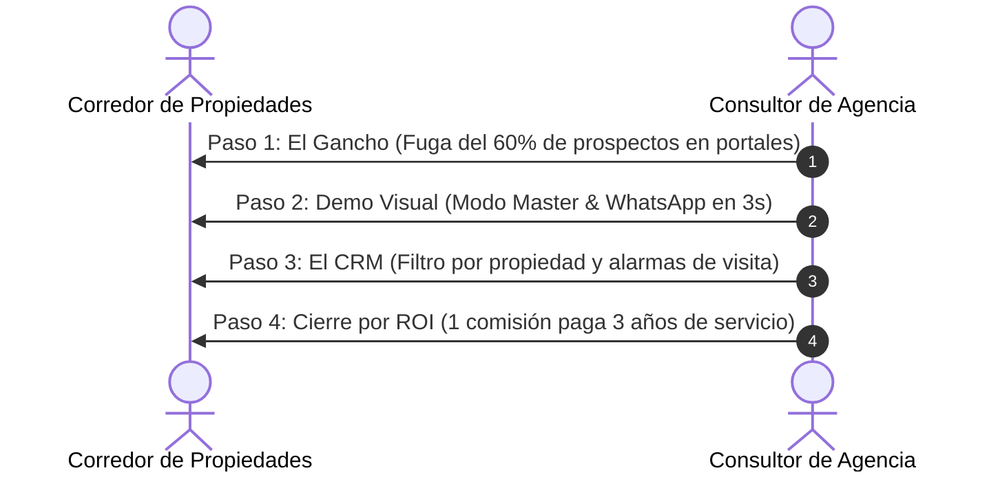

# 📑 Propuesta Comercial & Guía de Venta Consultiva
## Ecosistema de Captación y Conversión Inmobiliaria con Inteligencia Artificial

---

### 📌 Resumen Ejecutivo
Estructura de precios oficial bajo el modelo **Setup Inicial de Implementación (Pago Único) + Membresía Mensual Recurrente**, diseñado para ofrecer soluciones de software inmobiliario de alto valor a corredores de propiedades, corredoras boutique e inmobiliarias.

---

## 1. 🏷️ Estructura de Precios Oficial (Mercado Chileno / Regional)

| Concepto | Plan Starter (Web + CRM) | Plan Pro (Web + Agente Web IA) | Plan Full Ecosistema (Web + Agente WhatsApp IA) |
| :--- | :--- | :--- | :--- |
| **Setup Inicial (Pago Único)** | **$290.000 - $390.000 CLP** | **$450.000 - $590.000 CLP** | **$690.000 - $890.000 CLP** |
| *Incluye:* | Diseño a medida, catálogo inicial, CRM y dominio .CL. | Setup Starter + Entrenamiento del Concierge IA con su catálogo. | Setup Pro + Configuración e integración oficial del Agente de WhatsApp (YCloud). |
| **Membresía Mensual (Recurrencia)** | **$19.900 CLP / mes** | **$39.900 CLP / mes** | **$69.900 - $89.900 CLP / mes** |
| *Incluye:* | Hosting Vercel, soporte técnico, actualizaciones UF diarias. | Hosting + 1.000 créditos IA/mes + CRM en vivo. | Hosting + 3.000 créditos IA/mes + WhatsApp 24/7 + CRM unificado. |

---

### 💡 Justificación Estratégica del Modelo:
1. **Cobras el valor de tu trabajo el Día 1:** El setup de $290.000 a $690.000 CLP te entrega flujo de caja inmediato (*cashflow*) para financiar la personalización y puesta en marcha.
2. **Membresía accesible de por vida:** Una mensualidad de $19.900 a $69.900 CLP es extremadamente económica para el corredor, asegurando que permanezca suscrito durante años sin cancelar.
3. **Poder de Cierre en la Negociación:** El precio de lista del Setup te permite ofrecer descuentos agresivos de lanzamiento (*"Si cerramos hoy, te dejo el Setup Full en $490.000 en vez de $690.000"*).

---

## 2. 🎯 Guía Rápida de Ventas: Protocolo de Cierre en 4 Pasos

### ⏱️ Estructura de Reunión de 15 Minutos

#### Paso 1: El Gancho de Entrada (El Dolor del Corredor - 2 minutos)
> *"Estimado [Nombre], la gran mayoría de los corredores pierde el 60% de los interesados que consultan en Portales Inmobiliarios porque nadie les responde en los primeros 15 minutos o porque sus propiedades están mezcladas con las de su competencia. Nosotros implementamos un ecosistema privado que atiende, califica y agenda visitas en 10 segundos las 24 horas del día."*

#### Paso 2: La Demostración Visual en Vivo (5 minutos)
- Abre la web en tu celular o tablet.
- **Efecto Wow:** Haz 3 clics en el logo del panel, entra al *Modo Master* y cambia el nombre o la paleta de colores para mostrar que el sitio se viste con su marca en 10 segundos.
- **Interacción Real:** Pídele que le escriba un mensaje al número de WhatsApp de prueba. Que viva en carne propia cómo el bot le responde en 3 segundos, le pregunta su presupuesto y le ofrece agendar una visita.

#### Paso 3: El Panel de Gestión de Alto Volumen (3 minutos)
> *"Mira tu panel CRM: aquí ves a todos tus clientes ordenados. Puedes filtrar con un solo clic los clientes que tienen visitas hoy, o ver exactamente quiénes consultaron por tu casa en Las Condes sin tener que revolver cientos de chats desordenados de WhatsApp."*

#### Paso 4: El Cierre por Retorno de Inversión (ROI - 2 minutos)
> *"Una sola comisión de venta te genera entre $2.500.000 y $8.000.000 CLP. Con solo UNA operación que el asistente de IA te ayude a rescatar en todo el año, la implementación y la mensualidad ya se pagaron solas por los próximos 3 años completos. ¿Comenzamos con la configuración de tu marca esta semana?"*

---

## 3. 🛡️ Manejo de Objeciones Frecuentes

### ❌ Objeción 1: *"Ya publico en PortalInmobiliario y TocToc, no necesito otra web."*
💡 **Respuesta:**  
*"Exacto, los portales son geniales para publicar, pero ahí tu propiedad compite al lado de otras 50 similares. Este ecosistema es tu canal privado de cierre donde el cliente no ve a otros corredores y donde nuestro agente de IA atiende y califica de inmediato a los prospectos que llegan de tus redes o de tus letreros físicos."*

---

### ❌ Objeción 2: *"Yo prefiero responder el WhatsApp personalmente a mis clientes."*
💡 **Respuesta:**  
*"Por supuesto, tú eres el experto cerrando ventas. El agente de IA no reemplaza tu llamada; solo hace el trabajo repetitivo de filtrar curiosos a las 11 de la noche, verificar si tienen crédito pre-aprobado y entregarte el cliente listo en bandeja para que tú solo vayas a mostrar la propiedad."*

---

### ❌ Objeción 3: *"No tengo tiempo ni conocimientos técnicos para administrar una plataforma."*
💡 **Respuesta:**  
*"Nosotros nos encargamos del 100% de la parte técnica. Te entregamos la web y el WhatsApp listos para operar. Para subir una propiedad solo arrastras las fotos desde tu computador en 1 minuto o nos envías los datos por correo y nosotros lo configuramos."*

---

## 4. 🖨️ Cómo Generar el PDF Listo para Enviar:
1. Abre en tu navegador:  
   👉 `file:///B:/OneDrive/Desarrollo-IA/software/landing-ventas/public/propuesta_comercial_pdf.html`
2. Presiona el botón superior **"🖨️ Guardar o Imprimir en PDF"** (o `Ctrl + P`).
3. Selecciona **"Guardar como PDF"**. El diseño ejecutivo se ajusta de inmediato sin desconfiguraciones.
