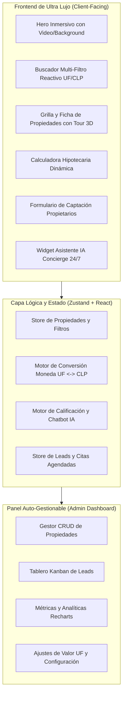

# Blueprint Maestro: Plataforma Inmobiliaria Auto-Gestionable con IA & CRM
> **Documento de Arquitectura, Fundamentos y Guía de Replicación para Negocios de Corretaje e Inmobiliarias.**
> Este archivo constituye la base maestra ("lienzo blanco") para desplegar, personalizar y comercializar soluciones digitales de alto impacto para cualquier corredora de propiedades.

---

## 1. Propósito y Modelo de Negocio de la Agencia

### 1.1 Objetivo del Producto
Transformar sitios web inmobiliarios estáticos y obsoletos (que sufren de fuga masiva de leads hacia portales como *Portal Inmobiliario*, *TocToc* o *MercadoLibre*) en **Ecosistemas Propios de Conversión Inmobiliaria**.

### 1.2 Propuesta de Valor para el Corredor / Inmobiliaria
1. **Retención Total del Tráfico:** Catálogo propio con buscador avanzado, evitando que el prospecto compare con inmuebles de la competencia.
2. **Atención y Calificación 24/7 con IA:** Un agente conversacional que atiende al instante, responde dudas técnicas/financieras, evalúa la capacidad de pago del lead y agenda visitas.
3. **Auto-Gestión y Control Operativo:** Panel administrativo sencillo para subir/editar propiedades, gestionar prospectos en un CRM Kanban y monitorear analíticas.
4. **Calculadora Financiera Inmediata:** Simulación de dividendos hipotecarios en UF/CLP con tasas bancarias reales del mercado.

---

## 2. Matriz de Personalización Rápida (White-Label Variables)

Para replicar este proyecto para un nuevo cliente en menos de 24 horas, solo se deben modificar los siguientes parámetros en el archivo central de configuración (`src/config/agencyConfig.ts`):

```typescript
export interface RealEstateBrandConfig {
  // Identidad Corporativa
  brandName: string;            // Ej: "UrbeGestión", "Zenith Properties"
  brokerName: string;           // Ej: "Pilar Osorio"
  tagline: string;              // Ej: "Más de 25 años de experiencia inmobiliaria"
  cityRegion: string;           // Ej: "Santiago, Región Metropolitana, Chile"
  logoUrl: string;
  faviconUrl: string;
  themeColors: {
    primary: string;            // Color primario corporativo (Hex)
    primaryHover: string;
    accent: string;             // Acentos dorados o esmeralda
    background: string;         // Modo claro / oscuro
    surface: string;
  };
  
  // Canales de Contacto
  contact: {
    phone: string;              // Ej: "+56979094519"
    whatsapp: string;           // Ej: "56979094519"
    email: string;              // Ej: "contacto@urbegestion.cl"
    address: string;
    operatingHours: string;
    instagramUrl?: string;
  };

  // Configuración de Mercado y Moneda
  market: {
    defaultCurrency: "UF" | "CLP" | "USD";
    ufValueClp: number;         // Valor UF actualizado (ej: 38.500)
    supportedComunas: string[]; // Lista de comunas activas para los filtros
    defaultMortgageRate: number;// Tasa anual estimada (ej: 4.8%)
  };

  // Parámetros del Asistente IA
  aiAgent: {
    botName: string;            // Ej: "UrbeBot", "Asistente Zenith"
    welcomeMessage: string;
    bookingCalendarUrl: string; // Link Calendly / Cal.com
    qualificationQuestions: {
      budget: boolean;
      preApprovedMortgage: boolean;
      moveInDeadline: boolean;
    };
  };
}
```

---

## 3. Arquitectura del Sistema y Stack Tecnológico



### 3.1 Tecnologías Seleccionadas
* **Framework:** React 18 + Vite (TypeScript).
* **Estilos & UI:** Tailwind CSS + Lucide Icons + Google Fonts (`Lato`/`Inter`).
* **Animaciones:** Framer Motion (`motion/react`) para micro-interacciones suaves de 60fps.
* **Gráficos:** Recharts para visualización de plusvalía y analíticas en CRM.
* **Gestión de Estado:** Zustand con persistencia local (`localStorage`) desacoplada y adaptable a Supabase/Firebase.

---

## 4. Esquema de Modelos de Datos

### 4.1 Modelo de Propiedad (`Property`)
```typescript
export interface Property {
  id: string;
  title: string;
  operation: "venta" | "arriendo";
  propertyType: "departamento" | "casa" | "parcela_agricola" | "oficina_comercial" | "terreno";
  priceUf: number;
  priceClp?: number;
  commune: string;              // Ej: "Las Condes", "Melipilla", "Vitacura" (52 Comunas RM)
  address: string;
  bedrooms: number;
  bathrooms: number;
  builtAreaM2: number;          // Metros construidos
  totalAreaM2: number;          // Metros totales
  parkingSpots: number;
  storageUnits: number;         // Bodegas
  featured: boolean;
  status: "disponible" | "reservada" | "vendida" | "arrendada";
  images: string[];
  description: string;
  features: string[];           // Ej: ["Piscina", "Quincho", "Seguridad 24/7", "Derechos de agua"]
  virtualTourUrl?: string;
  createdAt: string;
}
```

### 4.2 Modelo de Prospecto / Lead (`Lead`)
```typescript
export interface Lead {
  id: string;
  fullName: string;
  email: string;
  phone: string;
  propertyInterestId?: string;  // ID de la propiedad consultada
  operationInterest: "compra" | "arriendo" | "venta_propietario";
  budget: {
    amount: number;
    currency: "UF" | "CLP";
  };
  mortgageStatus: "al_contado" | "pre_aprobado" | "en_tramite" | "sin_evaluar";
  targetMoveDate: "inmediato" | "1_a_3_meses" | "mas_de_3_meses";
  status: "nuevo" | "contactado" | "visita_agendada" | "en_negociacion" | "cerrado" | "descartado";
  appointmentDate?: string;
  notes: string[];
  source: "asistente_ia" | "ficha_propiedad" | "formulario_contacto" | "captacion_propietarios";
  createdAt: string;
}
```

---

## 5. El Motor del Asistente IA Inmobiliario

### 5.1 System Prompt Base
```text
Eres el Asistente Virtual Inteligente de {BRAND_NAME}, liderada por {BROKER_NAME}, con amplia trayectoria en el mercado inmobiliario de {CITY_REGION}.

Tu misión principal es:
1. Dar la bienvenida con calidez, profesionalismo y confianza.
2. Identificar la necesidad del usuario: ¿Desea COMPRAR, ARRENDAR o VENDER una propiedad?
3. Indagar sobre la zona/comuna de preferencia y su presupuesto estimado (en UF o CLP).
4. Recomendar propiedades del catálogo disponible que coincidan con sus criterios de búsqueda.
5. Calificar financieramente al lead (si cuenta con crédito hipotecario pre-aprobado o compra al contado).
6. Ofrecer agendar una visita guiada presencial o llamada de asesoría directamente mediante el sistema de citas.
7. Solicitar nombre y número de WhatsApp para confirmar el agendamiento y enviar la ficha técnica.

Reglas de Comportamiento:
- Mantén un tono consultivo, educado y resolutivo.
- Nunca inventes propiedades fuera del catálogo registrado.
- Si el usuario busca tasación para vender su propiedad, guíalo al módulo de captación de propietarios.
```

### 5.2 Árbol de Calificación (BANT Inmobiliario)
1. **Presupuesto (Budget):** ¿Cuál es tu rango de inversión o canon de arriendo mensual?
2. **Autoridad/Financiamiento (Authority):** ¿Cuentas con crédito hipotecario pre-aprobado o financiamiento propio?
3. **Necesidad (Need):** ¿Qué características son indispensables? (Comuna, dormitorios, jardín, estacionamiento).
4. **Tiempo (Timing):** ¿En qué plazo planeas mudarte o concretar la operación?

---

## 6. Estructura de Módulos y Componentes de la Plataforma

```
src/
├── config/
│   └── agencyConfig.ts         # Configuración central white-label
├── data/
│   └── initialProperties.ts    # Datos iniciales realistas de Santiago
├── types/
│   ├── property.ts             # Interfaces TypeScript
│   └── lead.ts
├── stores/
│   ├── usePropertyStore.ts     # Estado de propiedades y filtros (Zustand)
│   ├── useLeadStore.ts         # Estado del CRM Kanban
│   └── useChatStore.ts         # Estado y memoria del asistente IA
├── components/
│   ├── layout/
│   │   ├── Navbar.tsx          # Cabecera con selector de moneda y acceso CRM
│   │   └── Footer.tsx          # Pie corporativo con datos de contacto
│   ├── hero/
│   │   └── HeroSection.tsx     # Hero inmersivo con video de fondo
│   ├── search/
│   │   └── SearchFilterBar.tsx # Barra de filtros multi-criterio en tiempo real
│   ├── properties/
│   │   ├── PropertyGrid.tsx    # Grilla de propiedades con animaciones Framer
│   │   ├── PropertyCard.tsx    # Tarjeta de propiedad con stats (m², dorms, baños)
│   │   └── PropertyModal.tsx   # Ficha completa, fotos, mapa y tour 3D
│   ├── calculators/
│   │   └── MortgageCalc.tsx    # Calculadora de dividendo hipotecario UF/CLP
│   ├── owners/
│   │   └── OwnerValuation.tsx  # Formulario multi-paso para captar vendedores
│   ├── chat/
│   │   └── AiChatWidget.tsx    # Widget flotante con asistente IA y agendamiento
│   └── admin/
│       ├── AdminDashboard.tsx  # Panel de control auto-gestionable
│       ├── PropertyManager.tsx # CRUD para añadir y editar propiedades
│       ├── KanbanBoard.tsx     # Pipeline visual de gestión de leads
│       └── AnalyticsView.tsx   # Gráficos de demanda y conversión (Recharts)
├── services/
│   └── aiService.ts            # Lógica de procesamiento y respuestas del bot
└── App.tsx                     # Orquestador principal de vistas
```

---

## 7. Procedimiento Operativo Estándar (SOP): Cómo Replicar para un Nuevo Cliente en < 2 Horas

1. **Clonación del Repositorio:** Copiar la base de código al nuevo directorio de proyecto.
2. **Ajuste de Variables en `agencyConfig.ts`:**
   * Reemplazar nombre del cliente, teléfonos, correos y enlaces de redes sociales.
   * Cargar la paleta de colores corporativos.
   * Colocar el logo en la carpeta `/public/assets/`.
3. **Carga de Inventario Inicial:**
   * Importar o ingresar las primeras 5 a 15 propiedades en `initialProperties.ts` o directo desde el Panel Admin.
4. **Configuración del Agente IA:**
   * Ajustar el mensaje de bienvenida y el enlace de agendamiento (Calendly de la corredora).
5. **Despliegue a Producción:**
   * Publicar en Vercel / Netlify / Cloudflare Pages en 1 clic con dominio personalizado (`.cl` o `.com`).

---

## 8. Estrategia de Venta de la Agencia de IA (Pitch y Cierre Comercial)

### 8.1 El Gancho: Auditoría de Fuga de Clientes
* **Pregunta de Apertura:** *"¿Sabías que al enviar a tus clientes a Portal Inmobiliario estás pagando por publicidad que termina mostrándoles propiedades de tu competencia directa?"*
* **Demostración en Vivo:** Presentar la demo funcionando con la marca del cliente, mostrando la velocidad de los filtros, la calculadora de dividendos y la atención inmediata del Asistente IA a las 11:00 PM.

### 8.2 Estructura de Oferta Comercial de la Agencia
1. **Paquete Setup (One-time):**
   * Despliegue de la Plataforma Web de Ultra Lujo con catálogo propio.
   * Configuración y entrenamiento del Asistente IA Inmobiliario.
   * Entrega del Panel Auto-Gestionable y CRM Kanban.
2. **Fee Mensual de Mantención & IA (Recurrente / Retainer):**
   * Servidor de alta velocidad y dominio seguro SSL.
   * Créditos del Asistente IA y soporte para carga de nuevas propiedades.
   * Reporte mensual de leads generados y métricas de conversión.
